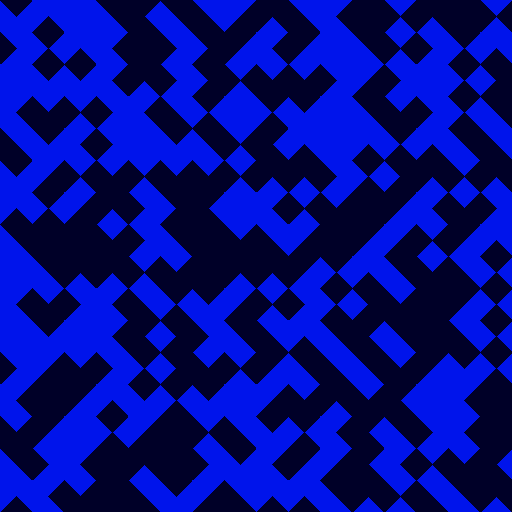

# Wang Tiles

Wang tiles were first proposed by mathematician, Hao Wang in 1961. A set of square tiles, with each tile edge of a fixed color, are arranged side by side in a rectangular grid. All four edges of each tile must 'match' (have the same color as) their adjoining neighbor.

See
- [http://www.cr31.co.uk/stagecast/wang/intro.html](http://www.cr31.co.uk/stagecast/wang/intro.html)
- [Wikipedia](https://en.wikipedia.org/wiki/Wang_tile)

## Output image


## Quick Start

Install rust and run

```console
$ cargo run
```
It generates a [ppm](https://en.wikipedia.org/wiki/Netpbm) image file which can be opened with [feh](https://feh.finalrewind.org/) or any other image viewer that supports ppm
